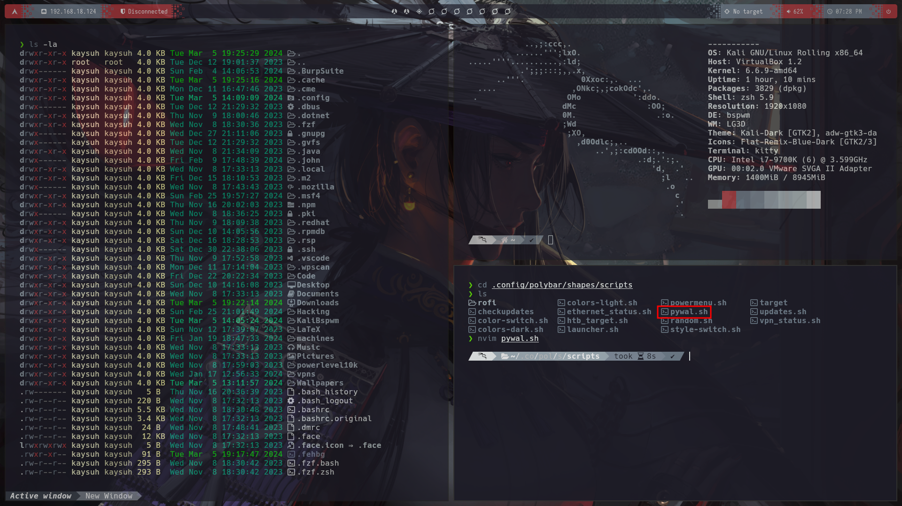
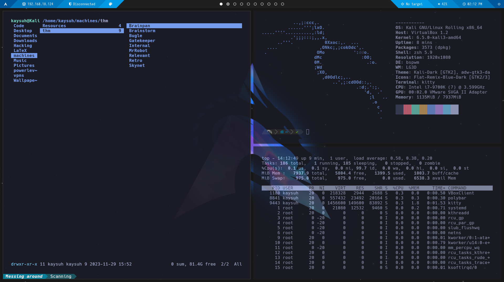
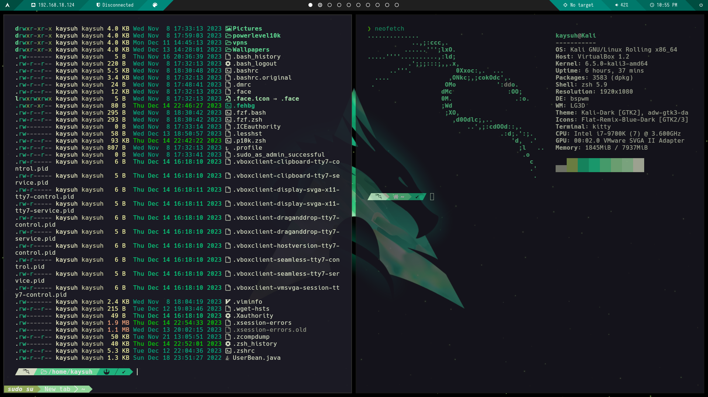

# Customization

## New update

### What have changed?
- There are new icons for the Workspaces which I consider fancier than the previous ones, however they're commented in the "workspaces" module section from ~/.config/polybar/shapes/modules.ini if you want to go back to the previous ones.
- New polybar will fade out over time and it will go a bit transparent, this is made via "Dim-Value" parameter at config.ini, there are also rounded corners because I got bored of the previous ones. Besides I've adjusted the offset and the widht in order to match the screen and the TTYs. If you're facing any trouble here, you should change the values at: ~/.config/polybar/shapes/config.ini and look for the parameters: "width" "offset-x". You'll have to touch a bit until they're fit, but there should be no problem.
- When you refresh BSPWM using  <kbd>Windows</kbd> + <kbd>Alt</kbd> + <kbd>R</kbd> it will no longer change your TTY colours that you have previously set by using **wal** command. This way you can keep your TTY colours as you like without resetting every time you change the background. You'll need to change it directly in ~/.config/bspwm/bspwmrc and change the **feh** path so it will load the wallpaper you want.
- Now Polybar and Rofi will match your chosen background colours using the following script: **~/.config/polybar/shapes/script/pywall.sh**.

### How to use the script
- If you have a look you will see the script has already set a -b option to have the blueish TTY background regardless of the wallpaper you choose, this is made intentionally because I want that specific colour. However you can change that background that is, in addition, the background for the unfilled part of the polybar by changing the hex-value code for the colour within the script. I found this script way better than having to choose by myself the colours and it also helps matching the exact colours taken from the .cache/wal. Besides it won't refresh with BSPM and you'll have to execute the script manually if you want to change those so imo it makes it more customizable.


## Overview:



## First Update:
Now you're p10k will match the theme color you choose:


## Instructions:
- Install and update your machine:
- ```bash
  sudo apt update
  sudo apt full-upgrade -y
  git clone https://github.com/K4ySuh/Kali-AutoBSPWM
  cd Kali-AutoBSPWM
  chmod +x setup.sh
  ./setup.sh
- Make sure you modify the script **setup.sh** before you run it, the part where you have to change and add the name of the wallpaper and colour schema you want is very noticeable, I ensure you. You can check the assets folder to see which ones are available!
- To make changes on your polybar scheme, just left click on the palette icon for colours and right click for styles.

## I don't like sudo icon on my p10k, how do I change it?
- ```bash
  sudo su
  cd
  vi .p10k.zsh
  # Go to normal mode (pressing Esc) and type:
  /ROOT_TEMPLATE
  # Go to nerdfonts on firefox -> click on "Icons" and look the one you prefer, copy it and paste on top on the previous one.
  # Go to normal mode again -> and type
  :wq!
  # Reopen kitty and check the icon has been changed.
  
  

## How to change Color Scheme
We'll rely on pywal feature. In order to change color scheme and get it auto-generated for the background you want you'll have to do as follows:
- wal -a 90 -b #\<HexBackgroundColourForTTY> -i /home/user/Wallpapers/\<archkali*.png>
- Which -b options could I use? here's a recommendation: for blue/green themes use the default one: #1c1b26. For the amber/ember you can use: #1d1c1c which is similar of Red-grey, while the first one is like gray-blueish
- Next step should be taking a look at: .cache/wal/colors-kitty.conf and modify in .config/kitty/kitty.conf the active and inactive tab backgrounds using those colours to match everything
- This colours come predefined the same as Amber,Red,Teal and Blue themes from polybar (all of which are followed by "-dark") so you can choose between those and the wal autogenerated's palettes will match your polybar.

## For laptop users:
There's a module called "battery" within the .config/polybar/shapes/modules.ini file. You'll have to add the module to the config.ini file and set it up following the defined estructure. You'll have to modify the following files: glyphs, modules and config.ini. You can modify the color scheme for polybar in the file colors.ini opening with nvim you'll be able to see the hex colours while editing. If you've never used polybar it could be a bit confusing but you'll find out how to follow the pattern after a few minutes of reading the code.


## Shortcuts BSPWM

- <kbd>Windows</kbd> + <kbd>Enter</kbd>: Open a terminal emulator window (kitty). 
- <kbd>Windows</kbd> + <kbd>W</kbd>: Close the current window.
- <kbd>Windows</kbd> + <kbd>Alt</kbd> + <kbd>R</kbd>: Restart the bspwm configuration.
- <kbd>Windows</kbd> + <kbd>Alt</kbd> + <kbd>Q</kbd>: Log out.
- <kbd>Windows</kbd> + <kbd>(⬆⬅⬇➡)</kbd>: Navigate through windows in the current workspace.
- <kbd>Windows</kbd> + <kbd>D</kbd>: Open Rofi. Press Esc to exit.
- <kbd>Windows</kbd>+ <kbd>(1,2,3,4,5,6,7,8,9,0)</kbd>: Switch to the respective workspace.
- <kbd>Windows</kbd> + <kbd>T</kbd>: Change the current window to tile mode.
- <kbd>Windows</kbd> + <kbd>M</kbd>: Toggle the current window to "full" mode (doesn't occupy the polybar). Press the same keys to return to tile mode.
- <kbd>Windows</kbd> + <kbd>F</kbd>: Change the current window to fullscreen mode (occupies the entire screen, including the polybar).
- <kbd>Windows</kbd> + <kbd>S</kbd>: Change the current window to floating mode.
- <kbd>Windows</kbd> + <kbd>Shift</kbd> + <kbd>(1,2,3,4,5,6,7,8,9,0)</kbd>: Move the current window to another workspace.
- <kbd>Windows</kbd> + <kbd>Alt</kbd> + <kbd>(⬆⬅⬇➡)</kbd>: Resize the current window (only works if it's in floating mode).
- <kbd>Windows</kbd> + <kbd>Ctrl</kbd> + <kbd>(⬆⬅⬆➡)</kbd>: Change the position of the current window (only works if it's in floating mode).
- <kbd>Windows</kbd> + <kbd>Shift</kbd> + <kbd>F</kbd>: Open Firefox.
- <kbd>Windows</kbd> + <kbd>Shift</kbd> + <kbd>B</kbd>: Open Burpsuite.
- <kbd>Ctrl</kbd> + <kbd>Alt</kbd> + <kbd>L</kbd>: Lock the screen.
- <kbd>Ctrl</kbd> + <kbd>Shift</kbd> + <kbd>⬆⬇</kbd>: Increase/decrease volume.
- <kbd>Ctrl</kbd> + <kbd>Shift</kbd> + <kbd>M</kbd>: Mute/unmute volume.
- <kbd>Windows</kbd> + <kbd>Ctrl</kbd> + <kbd>Alt</kbd> + <kbd>(⬆⬅⬇➡)</kbd>: Show a preselection and then open a window (kitty, Firefox, File manager, etc.).
- <kbd>Windows</kbd> + <kbd>Ctrl</kbd> + <kbd>Alt</kbd> + <kbd>Space</kbd>: Undo the preselection.
- <kbd>Ctrl</kbd> + <kbd>Shift</kbd> + <kbd>Enter</kbd>: Open a sub-window in the current window.
- <kbd>Ctrl</kbd> + <kbd>Shift</kbd> + <kbd>Z</kbd>: Zoom in on the current sub-window.
- <kbd>Ctrl</kbd> + <kbd>(⬆⬅⬇➡)</kbd>: Navigate between sub-windows in the current window.
- <kbd>Ctrl</kbd> + <kbd>Shift</kbd> + <kbd>R</kbd>: Resize the current sub-window. Afterward, use:
  - <kbd>W</kbd> for 'Wider'
  - <kbd>N</kbd> for 'Narrower'
  - <kbd>T</kbd> for 'Taller'
  - <kbd>S</kbd> for 'Shorter'
  - <kbd>R</kbd> for 'Reset'
- <kbd>Esc</kbd> to quit resize mode.
- <kbd>Ctrl</kbd> + <kbd>Shift</kbd> + <kbd>L</kbd>: Toggle the arrangement of sub-windows.
- <kbd>Ctrl</kbd> + <kbd>Shift</kbd> + <kbd>W</kbd>: Close the current sub-window or tab.
- <kbd>Ctrl</kbd> + <kbd>Shift</kbd> + <kbd>T</kbd>: Open a tab in the current window.
- <kbd>Ctrl</kbd> + <kbd>Shift</kbd> + <kbd>Alt</kbd> + <kbd>T</kbd>: Rename the title of the current tab.
- <kbd>Ctrl</kbd> + <kbd>Shift</kbd> + <kbd>(⬅➡)</kbd>: Navigate between current tabs.
- <kbd>Ctrl</kbd> + <kbd>Shift</kbd> + <kbd>C</kbd>: Copy to the clipboard.
- <kbd>Ctrl</kbd> + <kbd>Shift</kbd> + <kbd>V</kbd>: Paste from the clipboard.
- <kbd>F1</kbd>: Copy to buffer A.
- <kbd>F2</kbd>: Paste from buffer A.
- <kbd>F3</kbd>: Copy to buffer B.
- <kbd>F4</kbd>: Paste from buffer B.

## Extra:
  
  Dont' forget you're free to change the bspwmrc and wall files to modify the behaviour of the system every time you reload the BSPWM.
  You should also install:
  - [NVIM](https://github.com/neovim/neovim/releases/tag/stable)
    - first time you run it, you'll have to install the stuff. Just type N first input and later after everything is installed if you find any trouble while working with .sh files, open both nvims root and user and type: **TSInstall all** and let it finish. It'll solve your parse issues.
    - ```bash
      # Recommended installation:
      # Download the release resource
      mv /home/user/Downloads/nvim-linux64.tar.gz /opt/
      cd /opt
      tar -xf nvim-linux64.tar.gz
      rm nvim-linux64.tar.gz
      # Here you have 2 options ->
      # First one:
      cp nvim-linux64/bin/nvim /usr/local/bin/
      # Second one:
      # Open.zshrc and modify path to include /opt/nvim-linux64/bin:
      # Second option is probably easier and give less problems.
  - [FZF](https://github.com/junegunn/fzf) for root user
  - [Obsidian](https://obsidian.md/) It's a really cool application to take notes, creating writeups, etc. You can also combine it with Notion if you want portability between devices. You have an alias for this app in the .zshrc, you can check it to see where you should place the app-image.

## Troubleshooting:
There are few thinghs that potentially could go wrong since the script requires a bit more testing but it has worked for me multiple times in a row, enough to make me feel comfortable when providing it to other users, I'll make a quick guide here.
As you'll see the script will inform you about every step it's taking, if you find some trouble during the core installation it will let you know and where is the fail so you will know where is the problem. However, there are some fails
that could happen because of hardware, connections, etc. 
- One of the thinghs that could go wrong is polybar not detecting your IP. This is most likely gonna happen if you execute the setup in a Laptop, there's a script called: vpn-status in the following route: **/home/user/.config/polybar/shapes/scripts/**. This is the script in charge of displaying your IP on to your polybar. If your main card recieves a different name which is not "eth0" you'll have to change the value to match the name of your main network interface. Example: when you're executing the script on a Laptop, the main interface will probably be wlan0.
- p10k.zsh is not displaying as it should. In this case you'll have to check the names of the files, see if they've been installed properly or if you have both files in your user home and /root directories. But don't panic, if you have any trouble you can just dowload manually the files from the repo and paste them into their respective home (Remember to change the name for the Root one, or you can sym-link to the user one if you don't want them to be different).
- The installation went as intended but I don't have my colours matched with the background. Okay if you have this trouble go to **How to change Color Scheme**. Executing wal will make everything match.

## About
  Credit for the user [r1vs3c](https://github.com/r1vs3c) he develop the original script and the user [Cube](https://github.com/ZLCube) who created the original wallpaper. I have improved it, adding pretty much everything I'll need for qol in a fresh Kali machine, added new color palettes, different polybar, backgrounds enhanced with AI, added instructions for newer users on how to change and manage the environment, etc.
